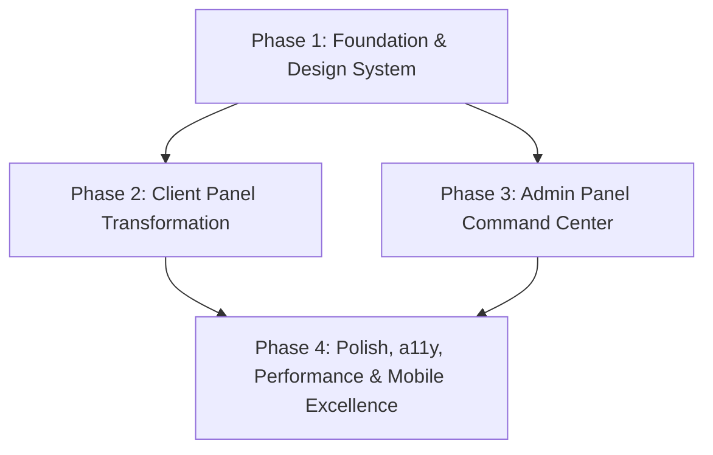
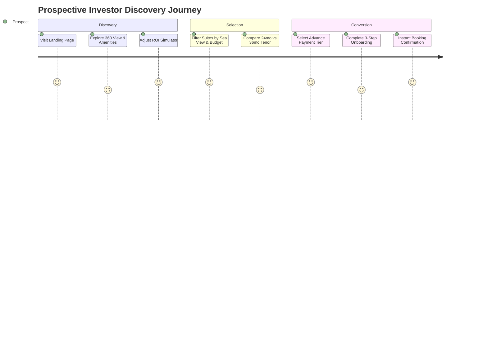
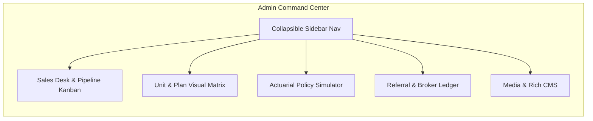

# Grand Sampan Resort — UI/UX Improvement Plan

> **Document Version:** 1.0.0  
> **Target Systems:** Client Panel (Public Marketing, Investor Portal, Booking Flow) & Admin Panel (Sales Desk, Unit Matrix, Policy Simulator, CMS)  
> **Brand Identity:** Deep Ocean Blue (`#0E3A5A`), Champagne Gold (`#D4AF37`), Pearl White (`#F8F8F6`), Sunset Orange (`#FF7A3D`), Playfair Display & Manrope/Inter typography.

---

## 1. Executive Summary & Design Vision

Grand Sampan Resort represents a high-value hospitality and timeshare investment asset located on the Cox's Bazar beachfront. The digital experience must balance two critical personas:
1. **The Prospective & Existing Investor (Client Panel):** Demands an ultra-luxury, high-trust digital environment with frictionless financial calculations, transparent ownership tracking, and effortless payment workflows.
2. **The Operations & Sales Team (Admin Panel):** Demands a dense, lightning-fast command center for inventory management, KYC audits, present-value pricing policy adjustments, and sales pipeline conversion.

This improvement plan outlines a **4-phase architectural and visual transformation** designed to eliminate existing UX friction, introduce a cohesive design system, and maximize conversion rates and operational efficiency.

---

## 2. Current State Audit & Key Friction Points

### 2.1 Client Panel UX Gaps
* **Monolithic Checkout & KYC ([pricing/plans/[id]/page.tsx](file:///C:/personal-tasks/ProspectBD/GrandSampanResort/frontend/app/pricing/plans/%5Bid%5D/page.tsx)):** 1,600+ lines in a single view combining KYC document upload, advance discount calculations, payment tier selection, and referral inputs without a progressive stepper, leading to high cognitive load and checkout drop-off.
* **Static Financial Data:** Expected ROI, advance payment discounts ([PAYMENT-PLAN-POLICY.md](file:///C:/personal-tasks/ProspectBD/GrandSampanResort/docs/PAYMENT-PLAN-POLICY.md)), and amortization schedules are presented as plain data tables rather than interactive sliders, milestone roadmaps, and comparison graphs.
* **Investor Dashboard Density ([investor/page.tsx](file:///C:/personal-tasks/ProspectBD/GrandSampanResort/frontend/app/investor/page.tsx)):** Lacks an asset construction tracker, dividend projection statements, downloadable legal deeds/certificates, and batch installment payment options.
* **Mobile Responsiveness & Touch Targets:** Form inputs and filter chips on catalog pages lack adequate touch target heights (min 44px) and clear touch feedback states.

### 2.2 Admin Panel UX Gaps
* **Navigation Architecture ([AdminShell.tsx](file:///C:/personal-tasks/ProspectBD/GrandSampanResort/frontend/components/AdminShell.tsx)):** A horizontal top-bar with 10+ tabs that overflow horizontally on laptops and tablets instead of a structured, collapsible hierarchical sidebar.
* **Sales Desk & KYC Audit ([admin/sales/page.tsx](file:///C:/personal-tasks/ProspectBD/GrandSampanResort/frontend/app/admin/sales/page.tsx)):** Manual review requires navigating between multiple tabs without side-by-side document inspection (e.g., viewing submitted NID/photo next to verification controls).
* **Financial Policy Engine ([admin/policy/page.tsx](file:///C:/personal-tasks/ProspectBD/GrandSampanResort/frontend/app/admin/policy/page.tsx)):** Complex actuarial variables (compounding frequencies, semiannual rates, tenor neutral vs PV pricing) lack real-time visual simulation curves and impact projections before saving.
* **Feedback & Safety:** Destructive actions (unit deletion, contract status cancellation) rely on basic browser alerts rather than contextual confirmation drawers and toast notification feedback.

---

## 3. Phased Implementation Roadmap

---

### Phase 1: Design System, Foundations & Shared Component Architecture

#### 1.1 Design Tokens & Theme Modernization
Establish a centralized design token system using CSS custom variables and Tailwind extensions to guarantee visual harmony across both panels:

| Token Category | Values / Tokens | Usage Context |
| :--- | :--- | :--- |
| **Primary Palette** | Ocean Deep (`#0E3A5A`), Ocean Dark (`#071F31`), Ocean Light (`#164E78`) | Brand headers, primary CTAs, active states |
| **Luxury Accents** | Champagne Gold (`#D4AF37`), Pale Gold (`#F4E8C1`), Metallic Bronze (`#997D25`) | Badges, highlight borders, premium tags, active tabs |
| **Neutral Canvas** | Pearl (`#F8F8F6`), Sand (`#EFECE6`), Slate Surface (`#FFFFFF`), Border Subtle (`rgba(14, 58, 90, 0.08)`) | Backgrounds, card surfaces, table separators |
| **Semantic States** | Success (`#10B981`), Warning (`#F59E0B`), Danger (`#EF4444`), Info (`#3B82F6`) | Status badges, KYC approval tags, alert banners |
| **Typography** | Headings: `Playfair Display` (serif, tracking `-0.02em`) Body/Data: `Inter` / `Manrope` (tabular numerals for currencies) | Editorial storytelling paired with high-legibility tabular financial figures |
| **Shadows & Elevation**| `shadow-subtle` (`0 2px 8px -2px rgba(14,58,90,0.05)`), `shadow-premium` (`0 12px 32px -4px rgba(14,58,90,0.12)`) | Layered elevation for modals, dropdowns, and cards |

#### 1.2 Shared Core UI Component Library
Develop reusable, accessible atomic primitives:
* **`StatusBadge`**: Supports animated dot pulses, semantic colors (`verified`, `pending`, `due`, `overdue`, `active`).
* **`MoneyDisplay`**: High-precision currency component with localized formatting (BDT / ৳), change indicators (+/- %), and responsive sizing.
* **`DataTable`**: Reusable data grid with sortable columns, sticky header, multi-filter dropdowns, pagination, and empty/skeleton states.
* **`ModalDrawer`**: Smooth animated slide-over drawer for desktop side-by-side editing and mobile bottom sheets.
* **`ToastSystem`**: Non-blocking notification stack for success, error, copy-to-clipboard, and background sync events.
* **`ConfirmDialog`**: Accessible double-action modal for dangerous/irreversible operations with typed confirmation when necessary.

---

### Phase 2: Client Panel Transformation (Guest & Investor Experience)

#### Phase 2.1 — Marketing & Discovery Overhaul
* **Hero Experience ([frontend/components/Hero.tsx](file:///C:/personal-tasks/ProspectBD/GrandSampanResort/frontend/components/Hero.tsx)):**
  * Introduce an interactive view selector directly on the hero (e.g., "Dawn Sunrise", "Aerial Bay View", "Sunset Infinity Pool").
  * Add a quick-estimate badge: *"Starting from ৳1.5L Downpayment · 8% Annualized Projected Returns"*.
* **Interactive Suite & Plan Browser ([frontend/app/invest/page.tsx](file:///C:/personal-tasks/ProspectBD/GrandSampanResort/frontend/app/invest/page.tsx)):**
  * Switch between **Grid View**, **Interactive Floor Keymap**, and **Financial Comparison Table**.
  * Add sticky quick-filters for Category (Standard, Delux, Premium), View (Sea, Hill), and Price Range sliders.
  * Card enhancement: Display instant net price calculations showing advance payment discount savings directly on hover.
* **Interactive Return Simulator ([frontend/app/returns-income/page.tsx](file:///C:/personal-tasks/ProspectBD/GrandSampanResort/frontend/app/returns-income/page.tsx)):**
  * Slider-driven calculator allowing buyers to toggle investment amount, stay days usage (0 to 30 days/year), and projected occupancy rates (55% to 85%) to visualize net annual yield and breakeven timeline.

#### Phase 2.2 — Frictionless Multi-Step Checkout & KYC Wizard
Refactor the monolithic [pricing/plans/[id]/page.tsx](file:///C:/personal-tasks/ProspectBD/GrandSampanResort/frontend/app/pricing/plans/%5Bid%5D/page.tsx) into a guided 3-step checkout stepper:

* **Step 1: Plan & Payment Customization:**
  * Interactive payment tier cards (10% Booking, 30% Booking+Down, 50% Half-Advance, 100% Full Payment) highlighting exact Taka savings computed live from `POST /api/booking/quote`.
  * Cadence selection (Monthly vs Quarterly installments; 24 vs 36 months tenor) with instant visual amortization table.
  * Real-time quote lock indicator countdown (30-minute validity timer).
* **Step 2: Digital KYC & Nominee Onboarding:**
  * Two-column split layout: Buyer details on the left, Nominee details on the right.
  * Drag-and-drop photo & NID scanner with instant client-side image compression and preview.
  * Autosave form state to `localStorage` so users never lose progress on accidental tab close or page reload.
* **Step 3: Summary, Legal Agreement & Instant Checkout:**
  * Clean contract summary card displaying suite specification, schedule milestones, and referral discount code.
  * Checkbox for Terms & Investor Protection Model with popup preview.
  * Multi-gateway checkout integration (Credit/Debit Card, bKash, Nagad, Direct Bank Wire Slip Upload).

#### Phase 2.3 — Investor Wealth & Ownership Portal ([frontend/app/investor/page.tsx](file:///C:/personal-tasks/ProspectBD/GrandSampanResort/frontend/app/investor/page.tsx))
Transform the investor dashboard into a comprehensive ownership suite:
* **Portfolio Health Overview:**
  * High-impact summary cards for Total Portfolio Value, Paid Capital, Remaining Installment Balance, and Next Due Date.
  * Circular progress ring illustrating overall investment completion %.
* **Construction & Project Milestone Tracker:**
  * Visual timeline showing resort construction phases (Foundation, Superstructure, Interior Fitout, Soft Opening, Handover).
  * Monthly photo/video construction updates feed with downloadable investor progress briefs.
* **Milestone Amortization Schedule & 1-Click Pay:**
  * Full interactive schedule table with status badges (`Paid`, `Due in 12 Days`, `Upcoming`).
  * "Pay All Upcoming Dues" batch payment button.
  * Instant PDF receipt download for completed installments.
* **Referral & Broker Growth Hub:**
  * Visual multi-tier earnings tracker (Tranche 1 upon booking confirmation, Tranche 2 upon downpayment clearance).
  * 1-click WhatsApp/Email referral sharing links with custom preview cards.
  * Lifetime referral payout history with status tags (`Unlocked`, `Pending Clearance`, `Disbursed`).

---

### Phase 3: Admin & Operations Command Center Transformation

#### Phase 3.1 — Modern Navigation & Layout Architecture ([frontend/components/AdminShell.tsx](file:///C:/personal-tasks/ProspectBD/GrandSampanResort/frontend/components/AdminShell.tsx))
* **Collapsible Sidebar Layout:**
  * Group routes into logical operational domains:
    * **Sales & CRM:** Sales Desk, Bookings Pipeline, KYC Queue, Investors.
    * **Inventory & Asset Control:** Units & Suites, Share Plans, Pricing Matrix.
    * **Financial Modeling:** Revenue Policies, Advance Discounts, Return Assumptions, Broker Policies.
    * **Content & Media:** Media Manager, FAQ Editor, Terms & Legal, Promotions.
  * Global Search Bar (`Cmd + K` / `Ctrl + K`) to immediately jump to any booking ID, unit number, or investor name.
  * Quick user status menu with active role badge and session expiry indicator.

#### Phase 3.2 — Sales Desk & KYC Audit Drawer ([frontend/app/admin/sales/page.tsx](file:///C:/personal-tasks/ProspectBD/GrandSampanResort/frontend/app/admin/sales/page.tsx))
* **Hybrid View Modes:**
  * **Kanban Board:** Drag-and-drop bookings between stages (`Deposit Placed` → `Downpayment Due` → `Active Installments` → `Completed` → `Flagged`).
  * **High-Density Table:** Sortable columns with sticky headers, multi-select checkboxes for batch status approvals.
* **Side-by-Side KYC Inspection Drawer:**
  * Clicking any buyer opens a 50% split slide-over drawer displaying buyer details and high-resolution NID/nominee photos on the left, with verification controls, risk score checks, and rejection notes on the right.
  * Instant 1-click SMS/Email trigger: *"Request Re-upload of NID"* or *"Approve & Issue Certificate"*.

#### Phase 3.3 — Unit & Share Plan Matrix ([frontend/app/admin/units/page.tsx](file:///C:/personal-tasks/ProspectBD/GrandSampanResort/frontend/app/admin/units/page.tsx))
* **Visual Floor Plan Grid:**
  * Interactive floor-by-floor view of the resort displaying unit occupancy and share distribution (e.g. Unit 402: 8/10 shares sold - Sea View).
  * Quick-edit inline pricing: Modify unit price or add promo tags without leaving the list view.
* **Batch Plan Generator:**
  * Single-modal workflow to generate 30-day, 5-day, or custom-day share plans across multiple units simultaneously.

#### Phase 3.4 — Financial Policy & PV Discount Simulator ([frontend/app/admin/policy/page.tsx](file:///C:/personal-tasks/ProspectBD/GrandSampanResort/frontend/app/admin/policy/page.tsx))
* **Real-Time Discount Curve Graph:**
  * Visual line chart comparing the nominal schedule present value against advance payment tiers (10%, 30%, 50%, 100%) across 24 and 36 months.
  * Dynamic sensitivity sliders for nominal annual rate (e.g., 6% to 12%) and semiannual compounding with immediate display of calculated buyer discounts and resort margin impacts.
* **Policy Snapshot Audit History:**
  * View historical policy changes with timestamps and admin user attribution to ensure compliance.

#### Phase 3.5 — Media & Content Engine ([frontend/app/admin/media/page.tsx](file:///C:/personal-tasks/ProspectBD/GrandSampanResort/frontend/app/admin/media/page.tsx))
* **Drag-and-Drop Asset Gallery:**
  * Batch upload with auto-tagging by suite ID, category (Lobby, Suite, Aerial, Beach), and aspect ratio.
  * Inline focal-point cropper ensuring hero carousel and thumbnail images look sharp on all device viewports.

---

### Phase 4: Polish, Accessibility, Performance & Mobile Excellence

#### 4.1 Micro-Interactions & Motion Design
* Smooth accordion animations for FAQ and legal terms.
* Shimmer loading skeleton states replacing generic spinners across both panels.
* Subtle numeric counter animations on statistics (GMV, portfolio values, commission totals).
* Micro-haptic-style button click transitions with clear loading spinners on async form submissions.

#### 4.2 Accessibility (a11y) & Usability Standards
* Full WCAG 2.1 AA contrast compliance across all text against Ocean (`#0E3A5A`) and Pearl (`#F8F8F6`) backgrounds.
* Semantic HTML5 landmark structure (`<header>`, `<nav>`, `<main>`, `<section>`, `<footer>`, `<aside>`).
* Comprehensive keyboard navigation support (`Tab`, `Esc` for modals, arrow keys for tab lists and image lightboxes).
* Screen-reader friendly `aria-live` announcements for dynamic quote updates and form error banners.

#### 4.3 Mobile & Responsive Optimization
* Convert wide data tables to card-based touch lists on mobile viewports (< 768px).
* Sticky bottom action bars on mobile checkout (e.g., *"Total: ৳4,50,000 · Proceed to KYC →"*).
* Native date-picker styling and numerical keypad triggers (`inputmode="numeric"`) on financial input fields.

---

## 5. Implementation Matrix & Prioritization

| Module / Screen | Primary Objective | UX Impact | Technical Complexity | Target Phase |
| :--- | :--- | :---: | :---: | :---: |
| **Design System & Tokens** | Unify typography, palette, shadows, and shared components | High | Medium | **Phase 1** |
| **Shared Primitives** | Modals, drawers, tables, badges, toasts, and confirm dialogs | High | Medium | **Phase 1** |
| **Catalog & Filter UX** | Multi-view suite explorer, net price tooltips, quick filters | High | Medium | **Phase 2.1** |
| **3-Step Checkout Stepper** | Break down monolithic booking page, live quote lock, KYC | Critical | High | **Phase 2.2** |
| **Investor Wealth Portal** | Milestone tracker, amortization schedule, 1-click batch pay | Critical | High | **Phase 2.3** |
| **Admin Shell & Sidebar** | Collapsible navigation, quick search (Cmd+K), responsive shell | High | Medium | **Phase 3.1** |
| **Sales Desk & KYC Drawer**| Side-by-side KYC document inspector, Kanban pipeline | Critical | High | **Phase 3.2** |
| **Policy Simulator Graph** | Visual PV curve simulator, sensitivity sliders, audit history | High | Medium | **Phase 3.3** |
| **Unit Floor Grid** | Visual floor-by-floor occupancy matrix & bulk plan creator | Medium | Medium | **Phase 3.4** |
| **a11y & Motion Polish** | Skeleton shimmers, WCAG AA compliance, mobile bottom bars | Medium | Low | **Phase 4** |

---

## 6. Success Metrics & KPIs

1. **Client Conversion Rate:** > 35% increase in completed booking reservations due to the 3-step checkout stepper and live quote clarity.
2. **KYC Drop-off Reduction:** < 10% incomplete KYC abandonment rate with autosave and clear document scanning feedback.
3. **Admin Verification Speed:** > 50% reduction in time-to-verify KYC documents using the side-by-side inspection drawer.
4. **Investor Retention & Self-Service:** > 80% of installment payments initiated directly through the investor dashboard milestone scheduler.
5. **Lighthouse Performance Score:** Target > 90 on Performance, Accessibility, Best Practices, and SEO across all client and admin views.
